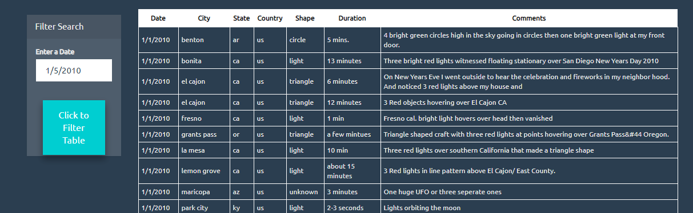

# Unit 14 | Assignment - JavaScript and DOM Manipulation

## Suvrangshu Ghosh

## How to execute the code?

### 1. Execute the index.html

It will open the page like shown below:

It will show all listings of UFO sightings from the file stored under /static/js/data.js file.

2. Please type in a date from the list in the input box.
3. Then press the button which says "Click to filter table". In the example shown below, I types date 1/5/2010

4. the code will filter and show data based on that date:

5. To refresh the data, you can delete the date and press the button, it will clear the old selection and display all data by default.

